

  <h2 align="center">HostelHub: Smart Room Allocation System</h2>

<!-- TABLE OF CONTENTS -->

  
<h2 style="display: inline-block">Table of Contents</h2>

    <li><a href="#about-the-project">About The Project</a></li>
      <li><a href="#tech-stack">Tech Stack</a></li>
      <li><a href="#screenshots">Screenshots</a></li>

<!-- ABOUT THE PROJECT -->
## About The Project
* Developed a multi-college hostel management system, enabling seamless room bookings across diverse hostels while offering one, two and four sharing options based on real-time availability, allowing students to book and later reallocate rooms, optimizing utilization and enhancing flexibility.
* The system also includes an admin module for comprehensive oversight, allowing administrators to add and update student information, add new rooms, and view all available rooms across the hostels. 
* Signup and login functionalities are also integrated.
  
### Technology Used

* HTML
* CSS
* Node.js
* Express.js
* MySQL

### Screenshots
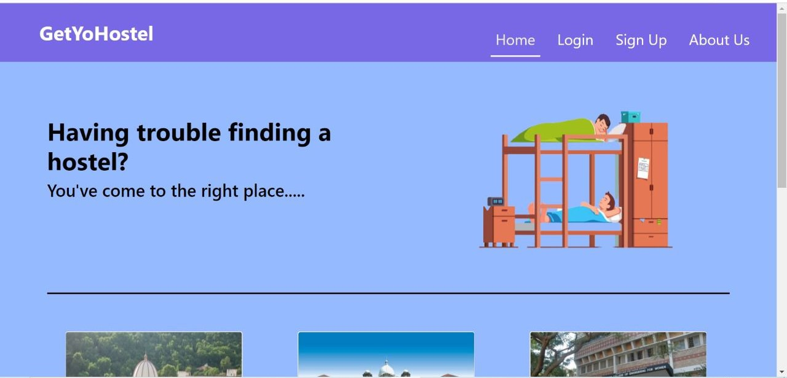
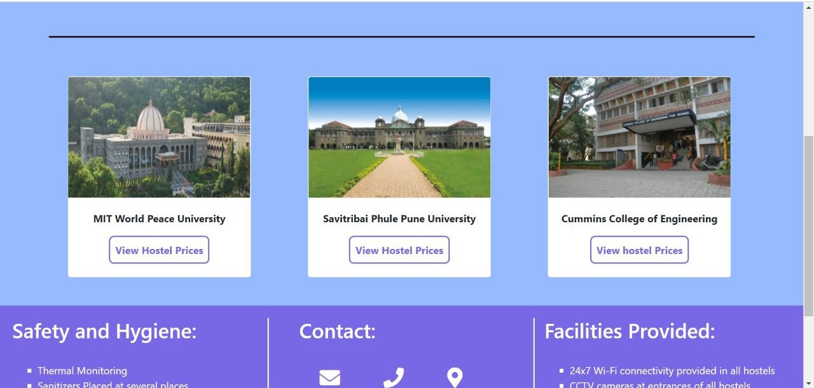
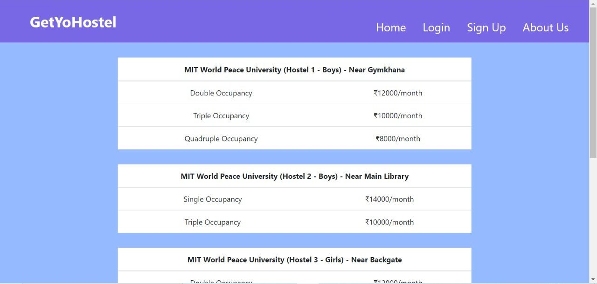
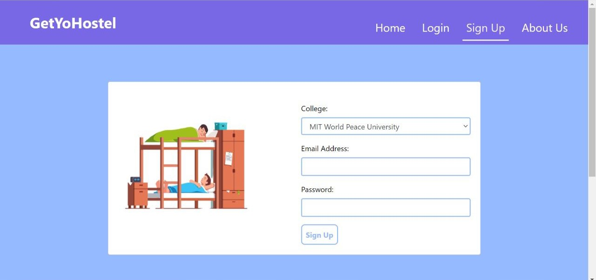
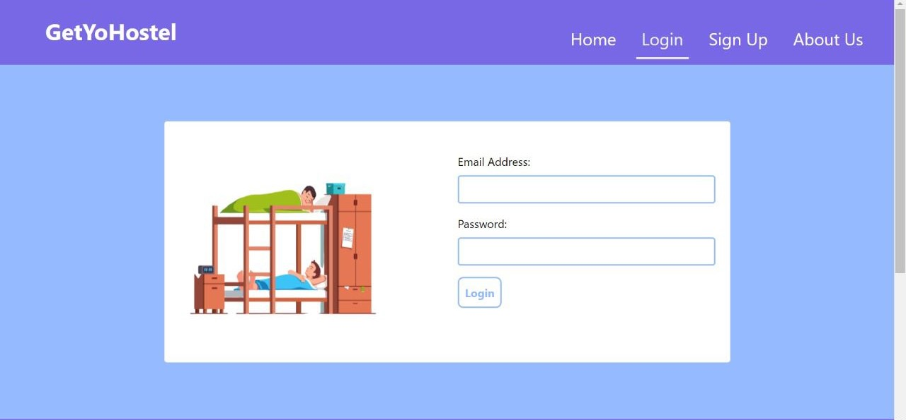
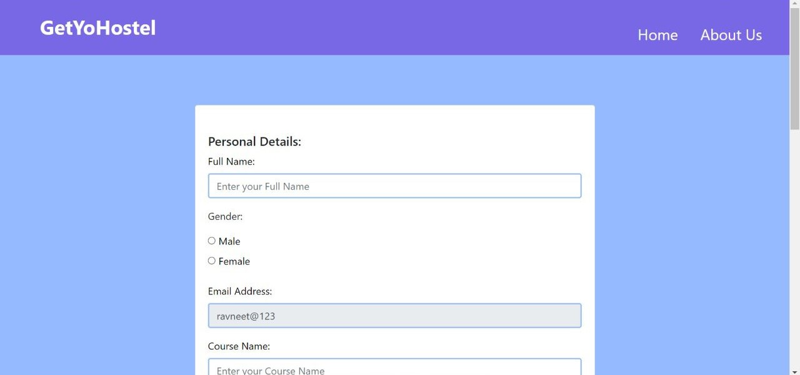
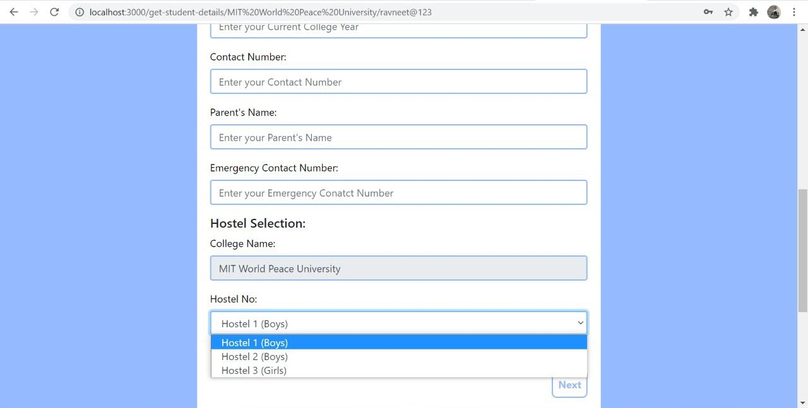
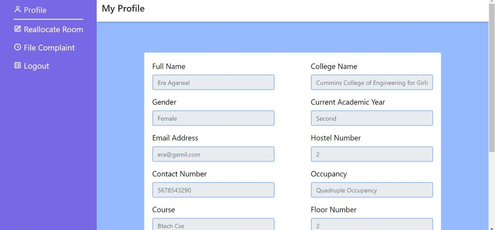
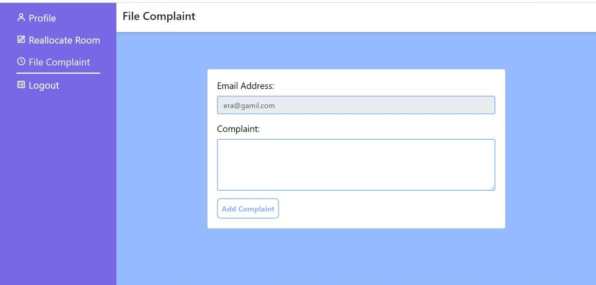
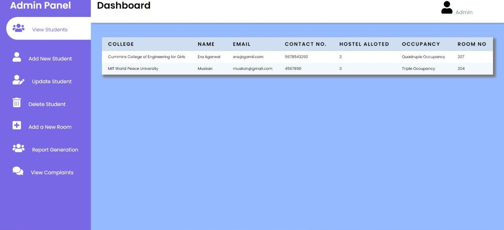
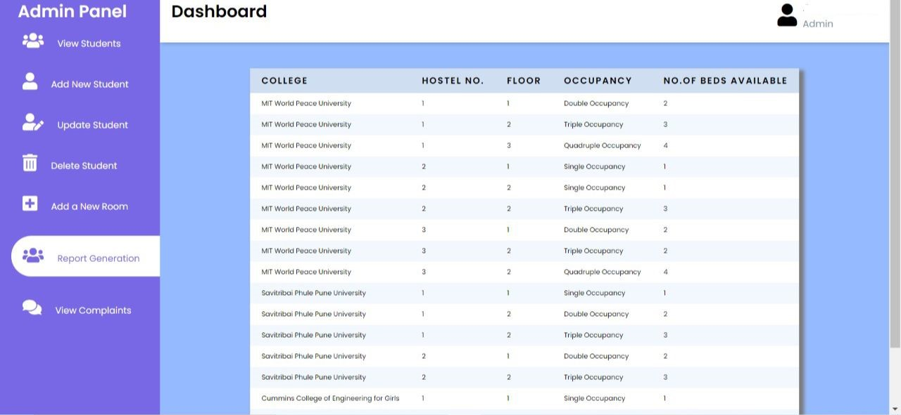
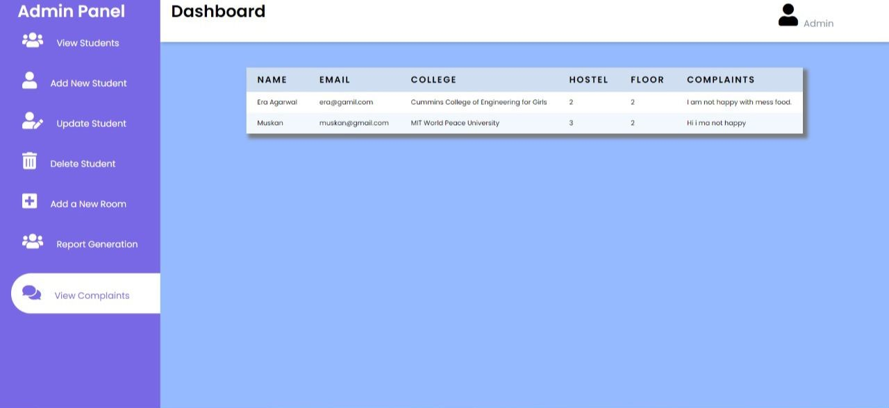
